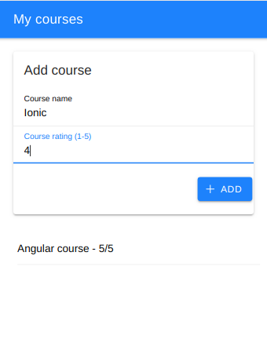

# My Courses

This project is one of the first requested during the **Build Native iOS & Android as well as Progressive Web Apps with Angular, Capacitor and the Ionic Framework (Ionic 4+)..** course by **Maximilian Schwarzmüller**

It consinst in an small ionic and pure javascript app. The input of the user is validated using javascript to ensure that the course name is not empty and the rating is in the 1-5 range.

## Screenshot

  

